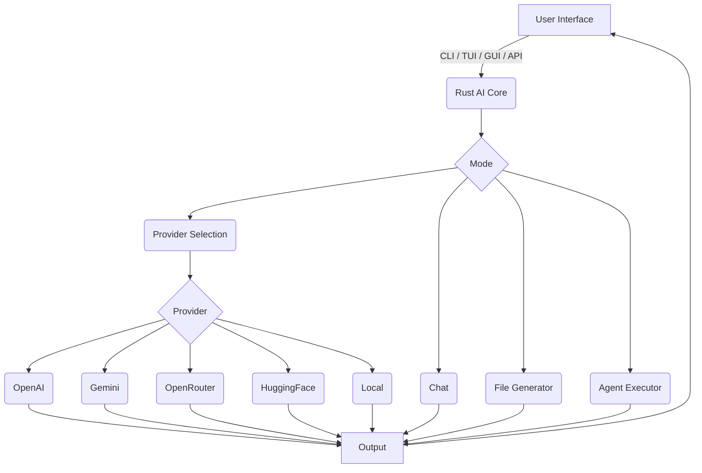

# Rust AI

<p align="center">
  
</p>

<h1 align="center">Rust AI</h1>

<p align="center">
  <a href="https://github.com/rust-ai/rust-ai/actions">
    
  </a>
  <a href="https://crates.io/crates/rust-ai">
    
  </a>
  <a href="https://docs.rs/rust-ai">
    
  </a>
  <a href="https://github.com/rust-ai/rust-ai/blob/main/LICENSE">
    
  </a>
</p>

**Rust AI** is a modular, high-performance AI framework written entirely in Rust. It supports integration with cloud-based and local AI models, providing unified access via CLI, TUI, GUI, or RESTful API.

---

## 🚀 Features

* **Multi-Provider Support**: Seamlessly switch between OpenAI, Gemini, HuggingFace, OpenRouter, and local models.
* **Local Model Integration**: Run and manage self-hosted models with ease.
* **Flexible Interfaces**: Includes command-line (CLI), terminal UI (TUI), graphical UI (GUI), and REST API endpoints.
* **Chat Mode**: Engage in dynamic, stateful AI conversations.
* **File Generation**: Generate full files from prompts.
* **Agent-Based Execution**: Automate workflows using AI-powered agents.
* **Extensible Architecture**: Modular design makes it easy to add new models, backends, and interfaces.
* **Rust Performance**: Leverages Rust’s memory safety and speed for efficient, low-latency AI.

---

## 📦 Installation

### Prerequisites

* [Rust and Cargo](https://rustup.rs/)

### Build from Source

```bash
git clone https://github.com/rust-ai/rust-ai.git
cd rust-ai
cargo build --release
```

The compiled binary will be located at:
`target/release/rust_ai`

---

## 💡 Usage

### Command-Line Interface (CLI)

**Text Generation**

```bash
cargo run -- cli --provider openai --prompt "Hello, world!"
```

**File Generation**

```bash
cargo run -- file --provider openai --prompt "Write a Python Hello World" --output hello.py
```

### Terminal UI (TUI)

```bash
cargo run -- tui
```

### Graphical UI (GUI)

```bash
cargo run -- gui
```

### REST API

**Start Server**

```bash
cargo run -- api
```

**POST /generate**

```http
POST http://127.0.0.1:8080/generate
Content-Type: application/json

{
  "provider": "openai",
  "prompt": "Hello, world!"
}
```

**Response**

```json
"This is a response from OpenAI."
```

---

## 🧠 Architecture Overview



---

## ✨ Example Feature

A sample feature has been implemented in:

> `rust_ai/src/new_feature.rs`

### Example Usage

```rust
use rust_ai::new_feature::new_rust_function;

println!("{}", new_rust_function());
```

---

## 🤝 Contributing

Contributions are welcome!

1. Fork the repository
2. Create a new branch: `git checkout -b feature/my-feature`
3. Commit changes: `git commit -m "Add my feature"`
4. Push the branch: `git push origin feature/my-feature`
5. Open a pull request

See [CONTRIBUTING.md](CONTRIBUTING.md) for more details (if available).

---

## 📜 License

This project is licensed under the MIT License.
See [LICENSE](LICENSE) for full details.

---
