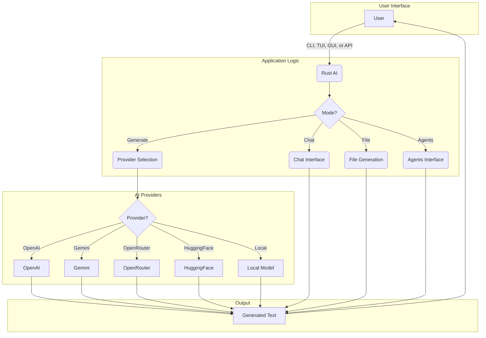

# Rust AI

<p align="center">
  
</p>

<h1 align="center">Rust AI</h1>

<p align="center">
    <a href="https://github.com/rust-ai/rust-ai/actions">
        
    </a>
    <a href="https://crates.io/crates/rust-ai">
        
    </a>
    <a href="https://docs.rs/rust-ai">
        
    </a>
    <a href="https://github.com/rust-ai/rust-ai/blob/main/LICENSE">
        
    </a>
</p>

**Rust AI** is a comprehensive and powerful AI system built entirely in Rust. It provides a flexible and extensible framework for integrating various AI models, including those from OpenAI, Gemini, OpenRouter, HuggingFace, and even local models.

## 🌟 Features

*   **Multiple AI Providers**: Seamlessly switch between different AI providers on the fly.
*   **Local Model Support**: Bring your own custom models and use them with Rust AI.
*   **Versatile Interfaces**: Interact with the system through a CLI, TUI, GUI, or a RESTful API.
*   **Chat Mode**: Engage in interactive conversations with the AI.
*   **File Generation**: Generate entire files based on a single prompt.
*   **Agents Mode**: Delegate tasks to a team of AI agents for collaborative problem-solving.
*   **Extensible Architecture**: Designed with modularity in mind, making it easy to add new providers and features.
*   **High Performance**: Built with Rust, ensuring memory safety and high performance.

## 🚀 Getting Started

### Prerequisites

*   [Rust and Cargo](https://rustup.rs/)

### Installation

Clone the repository and build the project:

```bash
git clone https://github.com/rust-ai/rust-ai.git
cd rust_ai
cargo build --release
```

The compiled binary will be located at `target/release/rust_ai`.

## 💻 Usage

### CLI

The CLI provides a simple and powerful way to interact with Rust AI from the command line.

#### Generate Text

```bash
cargo run -- cli --provider openai --prompt "Hello, world!"
```

#### Generate a File

```bash
cargo run -- file --provider openai --prompt "Create a hello world program in Python" --output hello.py
```

### TUI

The Text-based User Interface (TUI) offers a more interactive experience within the terminal.

```bash
cargo run -- tui
```

### GUI

The Graphical User Interface (GUI) provides a user-friendly way to interact with Rust AI.

```bash
cargo run -- gui
```

### API

The API allows you to integrate Rust AI into your own applications. The server runs on `http://127.0.0.1:8080`.

#### `POST /generate`

**Request:**

```json
{
    "provider": "openai",
    "prompt": "Hello, world!"
}
```

**Response:**

```
This is a response from OpenAI.
```

## 🏛️ Architecture

### High-Level Overview



## 🤝 Contributing

Contributions are what make the open-source community such an amazing place to learn, inspire, and create. Any contributions you make are **greatly appreciated**.

1.  Fork the Project
2.  Create your Feature Branch (`git checkout -b feature/AmazingFeature`)
3.  Commit your Changes (`git commit -m 'Add some AmazingFeature'`)
4.  Push to the Branch (`git push origin feature/AmazingFeature`)
5.  Open a Pull Request

## 📜 License

Distributed under the MIT License. See `LICENSE` for more information.

## 📞 Contact

Project Link: [https://github.com/rust-ai/rust-ai](https://github.com/rust-ai/rust-ai)
