# Rust AI

<p align="center">
  
</p>

<h1 align="center">Rust AI</h1>

<p align="center">
 
  <a href="https://crates.io/crates/rust-ai">
    
  </a>
  <a href="https://docs.rs/rust-ai">
    
  </a>
  <a href="https://github.com/rust-ai/rust-ai/blob/main/LICENSE">
    
  </a>
</p>

**Rust AI** is a high-performance, modular AI framework written in Rust. It supports multiple AI providers—cloud-based and local—accessible via CLI, TUI, GUI, and REST API.

---

## 🚀 Features

* 🔌 **Multi-Provider Support**: OpenAI, Gemini, HuggingFace, OpenRouter, and self-hosted models.
* 🧠 **Local Model Execution**: Bring your own fine-tuned models.
* 🧰 **Multiple Interfaces**: CLI, terminal-based TUI, graphical GUI, and REST API.
* 💬 **Chat Mode**: Stateful conversational experience.
* 📄 **File Generation**: Produce complete files from prompts.
* 🤖 **Agent Mode**: Automate workflows with AI-powered agents.
* 🧱 **Modular Architecture**: Easily extendable with new providers and features.
* ⚡ **Rust-Powered Performance**: Low-latency, memory-safe, and efficient execution.

---

## 📦 Installation

### Prerequisites

* [Rust toolchain (cargo, rustc)](https://rustup.rs)

### Build from Source

```bash
git clone https://github.com/rust-ai/rust-ai.git
cd rust-ai
cargo build --release
```

The binary will be available at:

```
target/release/rust_ai
```

---

## 💡 Usage Examples

### 📟 CLI

**Text Generation**

```bash
cargo run -- cli --provider openai --prompt "Hello, world!"
```

**File Generation**

```bash
cargo run -- file --provider openai --prompt "Generate Python Hello World" --output hello.py
```

### 🖥️ TUI

```bash
cargo run -- tui
```

### 🖼️ GUI

```bash
cargo run -- gui
```

### 🌐 REST API

Start the API server:

```bash
cargo run -- api
```

#### Endpoint: POST `/generate`

**Request**

```json
{
  "provider": "openai",
  "prompt": "Hello, world!"
}
```

**Response**

```json
"This is a response from OpenAI."
```

---

## 🧭 Architecture Overview

```mermaid
graph TD
    A[User] -->|CLI / TUI / GUI / API| B(Rust AI Core)
    B --> C{Mode}
    C --> D(Provider Selector)
    C --> E(Chat Handler)
    C --> F(File Generator)
    C --> G(Agent Executor)
    D --> H{Provider}
    H --> I(OpenAI)
    H --> J(Gemini)
    H --> K(OpenRouter)
    H --> L(HuggingFace)
    H --> M(Local Models)
    I --> N[Output]
    J --> N
    K --> N
    L --> N
    M --> N
    E --> N
    F --> N
    G --> N
    N --> A
```



---

## ✨ Example Feature

New module located at:

```
rust_ai/src/new_feature.rs
```

### Usage

```rust
use rust_ai::new_feature::new_rust_function;

println!("{}", new_rust_function());
```

---

## 🤝 Contributing

Contributions are welcome!

1. Fork the repo
2. Create a branch: `git checkout -b feature/my-feature`
3. Commit your changes: `git commit -m "Add feature"`
4. Push: `git push origin feature/my-feature`
5. Open a pull request

---
