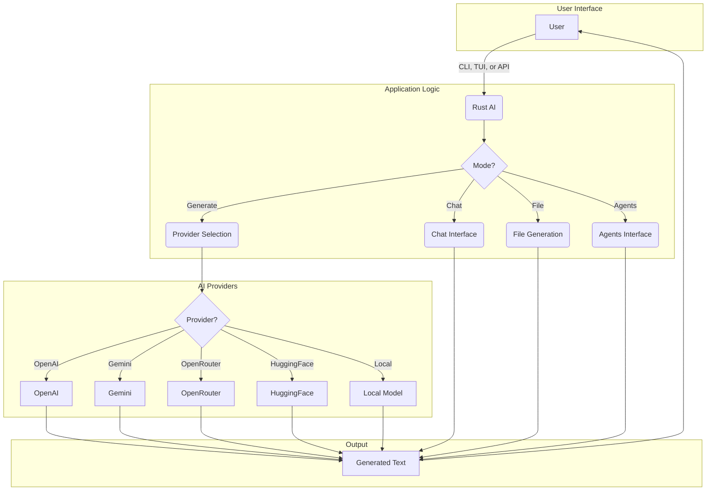
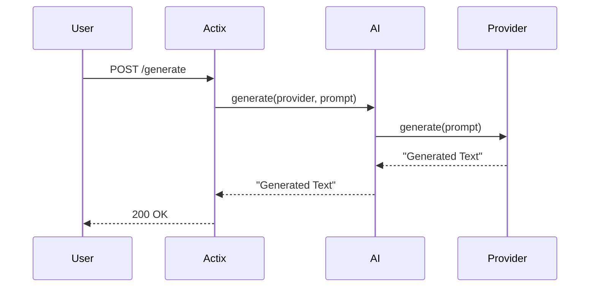
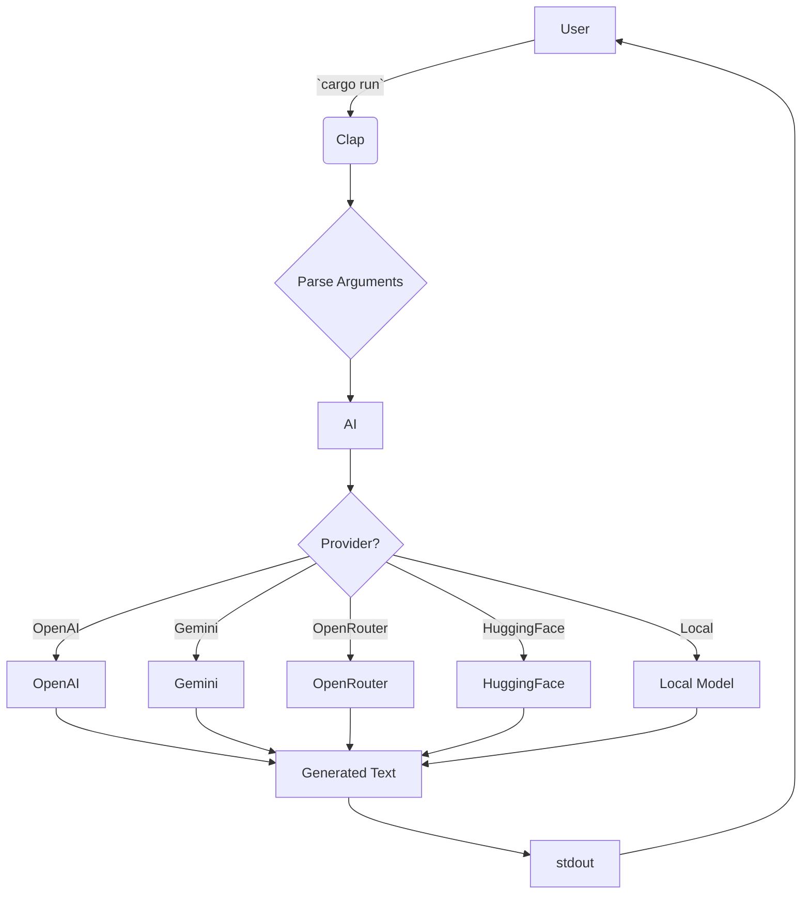

# Rust AI

This is a full and complete AI system thats built in pure RUST.

It will have options of using openai models , gemini models , openrouter , huggingface or even local models.

## Features

*   **Multiple AI Providers:** Switch between different AI providers on the fly.
*   **Local Models:** Use your own custom models.
*   **CLI, TUI, and API:** Interact with the system from the command line, a text-based user interface, or from other applications.
*   **Chat Mode:** Have a conversation with the AI.
*   **File Generation:** Generate entire files based on a prompt.
*   **Agents Mode:** Delegate tasks to a team of AI agents.

## Usage

### CLI

#### Generate Text

```bash
cargo run -- cli --provider openai --prompt "Hello, world!"
```

#### Generate a File

```bash
cargo run -- file --provider openai --prompt "Create a hello world program in Python" --output hello.py
```

### TUI

To run the TUI, use the `tui` subcommand:

```bash
cargo run -- tui
```

### API

The API is available at `http://127.0.0.1:8080`.

#### `POST /generate`

Request:

```json
{
    "provider": "openai",
    "prompt": "Hello, world!"
}
```

Response:

```
This is a response from OpenAI.
```

## Design and Architecture

### High-Level Overview



### API Request Flow



### CLI Request Flow



## Development

### Contributing

Contributions are welcome! Please open an issue or submit a pull request.

### Building from Source

To build the project from source, you will need to have Rust and Cargo installed. You can install them by following the instructions at [https://rustup.rs/](https://rustup.rs/).

Once you have Rust and Cargo installed, you can build the project by running the following command:

```bash
cargo build --release
```

The compiled binary will be located at `target/release/rust_ai`.

## Documentation

For more detailed documentation, see the `docs` directory.
