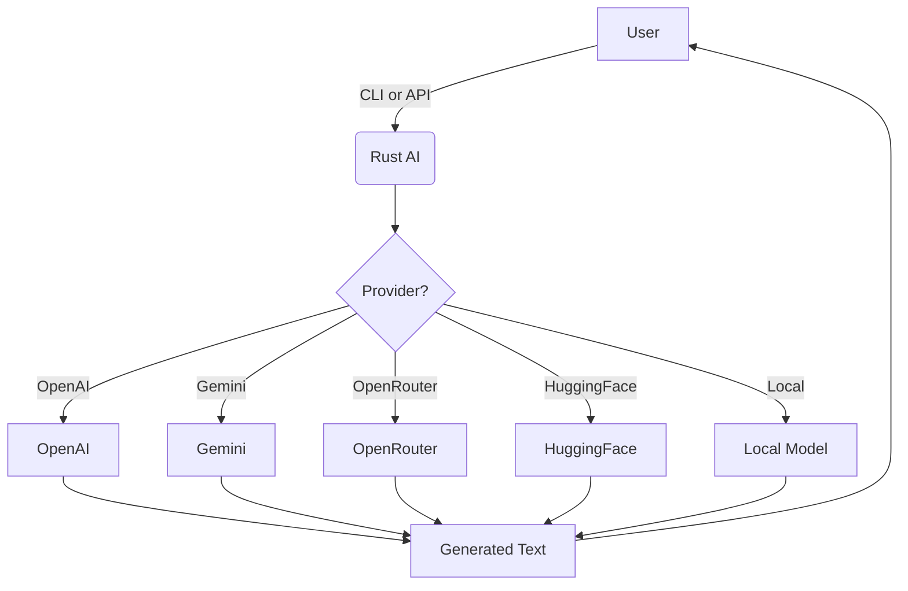

# Rust AI

This is a full and complete AI system thats built in pure RUST.

It will have options of using openai models , gemini models , openrouter , huggingface or even local models.

## Features

*   **Multiple AI Providers:** Switch between different AI providers on the fly.
*   **Local Models:** Use your own custom models.
*   **CLI and API:** Interact with the system from the command line or from other applications.

## Usage

### CLI

```bash
cargo run -- --provider <provider> --prompt <prompt>
```

### API

The API is available at `http://127.0.0.1:8080`.

#### `POST /generate`

Request:

```json
{
    "provider": "<provider>",
    "prompt": "<prompt>"
}
```

Response:

```
<generated text>
```

## Flowcharts

### High-Level Overview



### API Request Flow


### CLI Request Flow


## Documentation

For more detailed documentation, see the `docs` directory.
